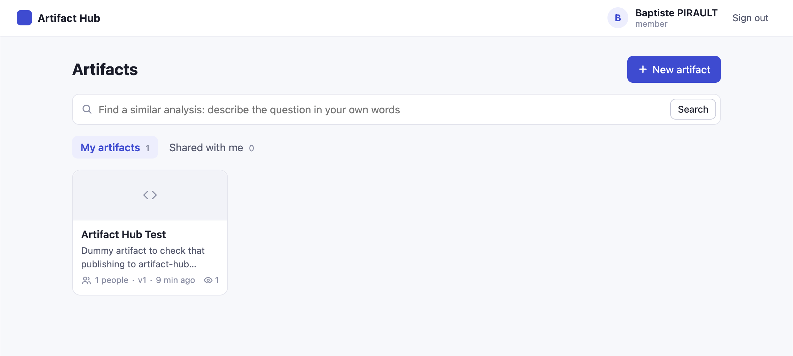

# Artifact Hub

Publish self-contained artifacts (interactive HTML, Markdown or plain text), share them
with specific people or the whole organisation, find similar ones, and open them in a
browser inside a locked-down sandbox. Artifacts can be published from the web app or by an
AI agent through the MCP endpoint, always attributed to the verified human behind it.



* **Web app** (React + Vite + TypeScript): my artifacts, shared with me, create / edit (new
  version) / rename (no version) / delete, version history with preview and restore, share
  dialog (private, specific people up to 100, whole organisation for the publisher group),
  semantic search, a viewer that renders the artifact in `<iframe sandbox="allow-scripts">`,
  and an admin console (totals, every artifact's metadata, withdraw sharing, flag
  sensitive, delete; administrators by group or by email).
* **Backend** (Python, FastAPI, Firestore): single-writer store with versioning and an
  800 KB body cap, REST API, sandbox content endpoint with a no-egress CSP, MCP endpoint
  (official `mcp` SDK, streamable HTTP), pluggable embeddings and vector search filtered by
  access rights, generic OIDC authentication.
* **Infra** (written, not applied): Dockerfile, Terraform for Cloud Run + Firestore
  (+ optional Cloud Storage and BigQuery event sink), GitHub Actions workflow.

## Repository layout

```
backend/
  artifact_hub/
    api.py            FastAPI app: /api, /a/{id} sandbox, /mcp dispatch, SPA
    service.py        use cases shared by REST and MCP (NotFound hides private artifacts)
    access.py         the authorization policy (open / manage / delete / org-wide share)
    sandbox.py        CSP + hardening headers, safe Markdown, render tickets, CDN linter
    mcp_server.py     MCP tools + RFC 9728 protected resource metadata
    config.py         settings from environment variables
    auth/             OIDC verifier (JWKS), dev identities, Principal
    store/            base (all rules) + memory and Firestore backends
    search/           embedding providers (fake, Vertex AI), brute-force index, service
  tests/              pytest suites (memory always, Firestore emulator when available)
  scripts/seed_demo.py
frontend/
  src/pages           Gallery, Editor, Viewer, Login, Callback
  src/components      ArtifactFrame (the only iframe), ShareDialog, VersionsPanel, ...
  src/lib             auth (oidc-client-ts, dev mode), API client
firebase/             Firestore rules (deny-all for clients) and index overrides
infra/terraform/      Cloud Run, Firestore, Secret Manager, optional GCS / BigQuery / WIF
.github/workflows/    CI: tests + checks; deploy template (dev on main, prod on tag)
docs/                 architecture, security, configuration, open points
```

## Run locally

Prerequisites: Python 3.12 (`uv`), Node 22, and for the Firestore backend the
`gcloud` CLI with the `cloud-firestore-emulator` component and a Java 21+ runtime.

```bash
make install

# Terminal 1: Firestore emulator (optional: use `make api-memory` instead of `make api`)
make emulator            # PATH must expose Java 21+, e.g. /opt/homebrew/opt/openjdk@21/bin

# Terminal 2: API on http://localhost:8080 (DEV AUTH MODE)
make api                 # or: make api-memory

# Terminal 3: web app on http://localhost:5173
make web

# Optional demo data (then sign in as Alice, Bob, Carol or Dave)
make seed
```

The API starts in **DEV AUTH MODE** by default: it accepts `Authorization: Bearer
dev:<email>` and the web app shows a login picker with fake identities (Alice is in the
publisher group, Carol in the admin group; add `ADMIN_EMAILS` / `DEV_USERS` to try an
administrator by email). A yellow banner is always displayed, and the
backend refuses to start in dev mode when `ENVIRONMENT=prod`.

Production-like single-origin run (SPA served by the API, as in the container):

```bash
cd frontend && VITE_API_BASE= npm run build && cd ..
cd backend && STATIC_DIR=../frontend/dist APP_ORIGIN=http://localhost:8080 CORS_ORIGINS= \
  .venv/bin/uvicorn artifact_hub.api:create_root_app --factory --port 8080
```

### Try the MCP endpoint

```bash
curl -s -X POST http://localhost:8080/mcp \
  -H 'Authorization: Bearer dev:alice@example.com' \
  -H 'Accept: application/json, text/event-stream' -H 'Content-Type: application/json' \
  -d '{"jsonrpc":"2.0","id":1,"method":"tools/call","params":{"name":"search_artifacts","arguments":{"query":"revenue per region"}}}'
```

Without a token, `/mcp` answers `401` with
`WWW-Authenticate: Bearer resource_metadata=".../.well-known/oauth-protected-resource/mcp"`.

## Tests

```bash
make test                # backend (in-memory backend) + frontend unit tests + build
make test-emulator       # backend against the Firestore emulator as well
```

## CI/CD

`.github/workflows/ci.yml` runs on every pull request and push to `main`:

1. **backend**: pytest against the in-memory store and the Firestore emulator.
2. **frontend**: `npm test` and a production build.
3. **terraform**: `fmt -check` and `validate` (no backend, nothing applied).
4. **deploy (template)**: builds the image, deploys it to Cloud Run (dev on `main`, prod
   on a `v*` tag) and smoke-tests `/api/health` and `/mcp`. It is **skipped** until the
   repository variables listed at the top of the workflow are set (outputs of
   `infra/terraform`), so a fork stays green until it is wired to its own project.

## Documentation

* [docs/architecture.md](docs/architecture.md): components, data model, request flows,
  why one service, search options for production.
* [docs/security.md](docs/security.md): sandbox model, authorization matrix, residual risks.
* [docs/configuration.md](docs/configuration.md): every environment variable, IdP setup
  (Entra ID, Okta, Google).
* [docs/open-points.md](docs/open-points.md): MCP client registration (DCR / CIMD), IAP vs
  OIDC, large bodies on Cloud Storage, and the rest of the backlog.

## License

[MIT](LICENSE)
